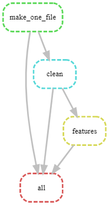

# Проект по определению показателей автоклавного окисления по историческим данным

Для промышленного процесса автоклавного окисления золотосодержащих концентратов имеется большой массив данных, полученных в ходе работы предприятия за почти 4 года.

На основании этих данных методами машинного обучения разрабатывается модель, показывающее текущее значение такого показателя качества окисления, как концентрация $Fe^{2+}$.

## Замечания
### Сборка исходных данных
Для сборки исходных данных используется *snakemake*.

Текущая схема обработки данных:

### Эксперименты
- EDA_all.ipynb - изучение исходных данных, построение правил для очистки и генерации новых признаков.
- EDA_clean_featured_df.ipynb - изучение и распределение данных после очистки и генерации новых признаков.

- Model_catboost.ipynb - модель Catboost и небольшая оптимизация параметров
- Model_lgbm.ipynb - модель LightGBM и оптимизация параметров, оценка модели, важность признаков
- Model_linear.ipynb - линейная модель

- Model_test_2022.ipynb - проверка моделей на новых данных 2022 года

Для подбора параметров модели использовался трекинг экспериментов [Weights and Biases](https://wandb.ai/site).
